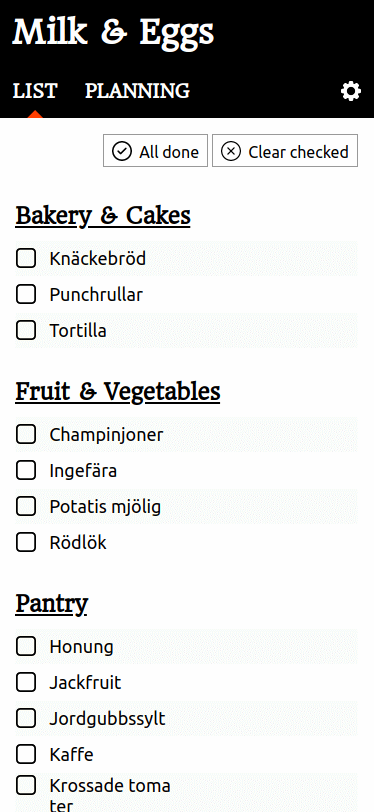
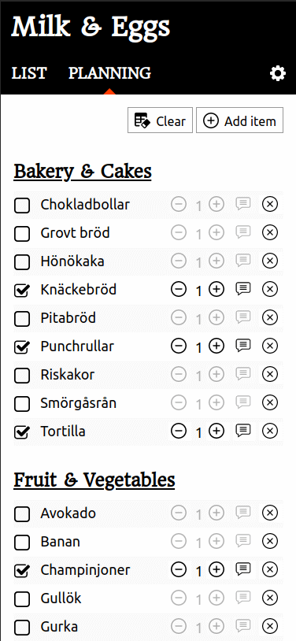

# Milk & Eggs

This is a grocery list manager built as a [Progressive Web App](https://web.dev/progressive-web-apps/). Meaning, it can run smoothly on your phone or your computer.

There are a lot of grocery list managers out there, but this one is unique in the way it handles recurring items. Instead of adding items _one time_ and then they are gone, you add them before a visit to the shop and just enable the items you are missing.

For me, the main problem wasn't really adding things to a list, but rather remembering what items I will need. There were maybe 100 items I wanted at home _always_, and I often forgot many of them. This way, you can quickly go through the list and just check the items that are missing.

The list doesn't try to know your needs. No items are added by default. It's your life, and your job to populate the list.

This manager is meant to share with a partner or a friend. There is no limit on how many people can share a list. And it's really really fast as well. If you add an item to the list, your partner will see it within a second! No user account is needed. No personal details. Just a list ID.

## Screenshots

Sorry for my Swedish items :)

## Features

- **List mode:** The one to use while in the store. Just check the items you picked up, and clear them when you are out of the store.
- **Planning mode:** Add new items, check items that you want to remember to buy on your next store visit. You can change the quantity of each item rather than adding multiple types of items. You can also comment on the items, like "No green ones" to "bananas" for your partner to know. There are a search if you have more items than 20.
- **Languages:**: You can change language between English and Swedish.
- **Share list**: You can share the list with a partner or a friend by simply pressing a button. The co-shopper will get a link, and when pressed it will be connected.
- **Backup/Restore**: You can also backup and restore your list. Also move the contents of one list to another.

## Add your language

Are you missing your language in the app? Please help me with the translations by forking this repo, adding a file to /src/lang. Just copy en.json and change the values. Make a pull request and I will merge it and deploy it as fast as possible.

## Tech

The app uses:

- Svelte and Sveltekit
- Typescript
- Firebase real time databases
- svelte-i18n

## For the future

- Ability to have multiple lists at the same time.
- Add option to repopulate the list with items in the selected language. Some people might find the app boring when empty and just leave.

## Live site

https://www.milkandeggs.app

When visiting on a mobile phone you will be asked if you want to add the site as an app.
